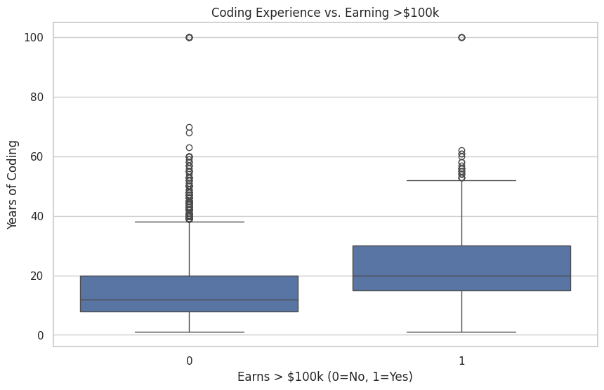
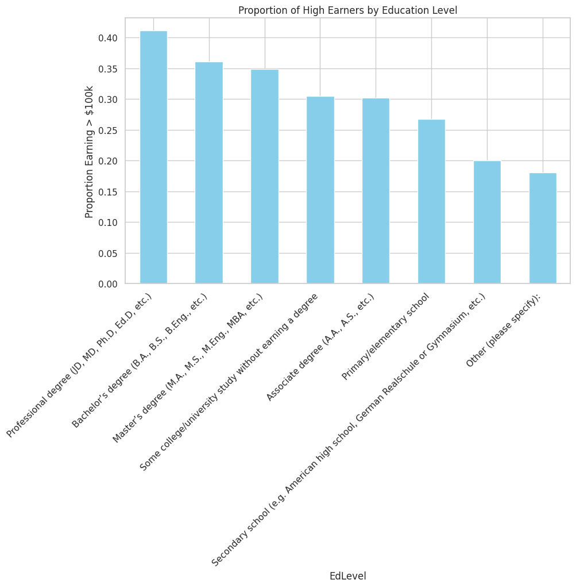
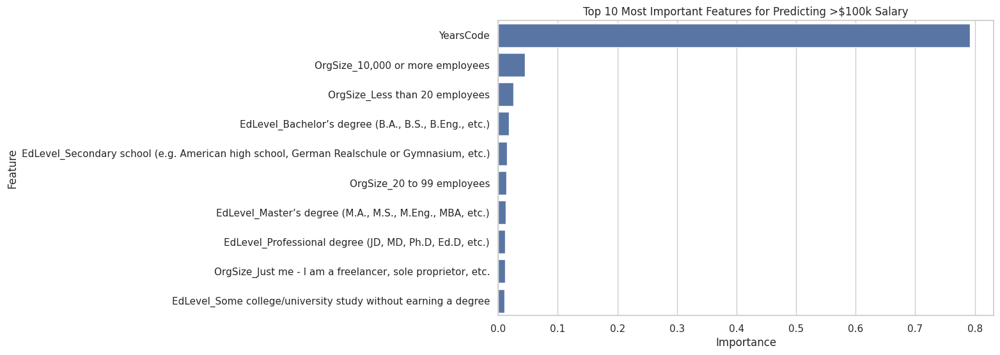

Title: The $100k Question: Do You Really Need a Degree to Make Bank in Tech?
Subtitle: Unpacking the StackOverflow Developer Survey to find out what actually drives a six-figure salary.

Introduction
If you are breaking into tech, you’ve probably asked yourself: Should I go back to school? Does experience matter more than where I work? To find the answers, I dug into the StackOverflow Developer Survey dataset for my Udacity Data Science Nanodegree project. Using the CRISP-DM (Cross-Industry Standard Process for Data Mining) methodology, I analyzed thousands of developer responses to answer a few key questions about what really drives a high salary (defined as over $100,000 USD).

Here is what I found.

1. Does coding experience linearly translate to higher pay?

Unsurprisingly, yes. When looking at developers earning over $100k versus those earning under, the median years of coding experience is significantly higher for the top earners. The data shows that time-in-seat is one of the strongest barriers to high-level compensation.

2. Does formal education level still matter in tech?

We hear a lot about college dropouts becoming tech billionaires, but what about the average worker? Looking at the proportion of high earners by education level, having a Bachelor's or Master's degree does provide a slight bump in the probability of earning over $100k compared to having no formal degree. However, the gap is surprisingly not as massive as it is in traditional corporate industries like finance or law.

3. What are the most important features driving a six-figure salary?
To take things a step further, I trained a Random Forest Machine Learning model to predict whether a developer would make over $100k based on three things: their years of coding, their education level, and the size of their company.

The results were eye-opening. The algorithm determined that Years of Coding completely eclipsed Education. Formal education levels consistently ranked at the bottom of the feature importance chart.

4. Putting the Model to the Test: A Creative Scenario
What happens if we feed a hypothetical scenario into our trained model?

I created a fake developer profile to test the algorithm's bias. I gave this hypothetical developer:

A Master's Degree

A job at a massive enterprise company (10,000+ employees)

Only 5 years of coding experience

When passing this profile through the model, the prediction engine ruthlessly classified this individual as a Low Earner (<= $100k) with a probability of earning over $100k sitting at 0.00%.

Because the algorithm learned from thousands of real-world survey responses, it realized a very strict rule: you cannot skip the line. Even with a Master's degree and a massive corporate budget, 5 years of experience is simply not enough time-in-seat to command a top-tier tech salary in the average market. When I tweaked the code to give the same developer 15 years of experience, the probability skyrocketed.

Conclusion
While education helps, it is not the ultimate golden ticket in tech. If your goal is strictly financial compensation, don't worry about stacking degrees. Focus on getting years of professional code under your belt. Experience is, and remains, king.
